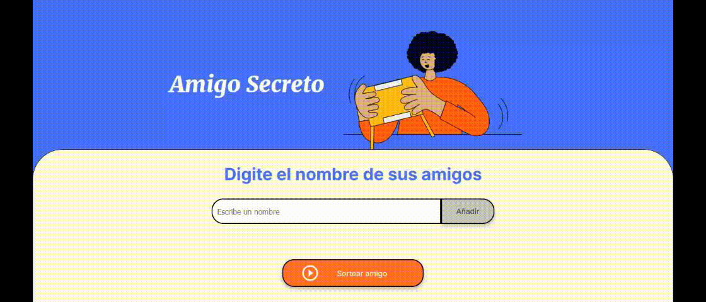

    <h1 align='center' style="font-weight: bold;"> Amigo Secreto</h1>
     
     
    </img>

## 🛫 Descripción del proyecto 🛫

_El proyecto Amigo Secreto es una aplicación  que permite a un usuario ingresar nombres de amigos y de todos ellos mediante un sorteo aleatorio elegir uno,  el "amigo secreto"_.

_Este proyecto es un desafío realizado para el programa ONE, Oracle Next Education, con el objetivo de poner en práctica los fundamentos de la lógica de programación utilizando el lenguaje JavaScript_. 

_El usuario deberá agregar nombres mediante un campo de texto y un botón "Adicionar". Los nombres ingresados se mostrarán en una lista visible en la página, y al finalizar, un botón "Sortear Amigo"seleccionará uno de los nombres de forma aleatoria, mostrando el resultado en pantalla_.

    </img>

 

## 💻 Instalación del proyecto 💻

_Descargar el proyecto desde <a href='https://github.com/JGarcia575/amigo-secreto'>aquí</a> y abrirlo con un editor de código_.

## 🚧 Estado del proyecto 🚧

_Finalizado_.

## ⚒️ Funcionalidades del proyecto ⚒️

- Añadir nombres: _el usuario añadirá un nombre en un campo de texto y podrá agregarlo a través del botón "Añadir" a una lista visible_.

- Validar entrada: _si el usuario ingresa en el campo de texto solo espacios, nombres vacíos, números o si el nombre esta repetido, la aplicación lanzará un alerta indicando al usuario que escriba un nombre válido. Además, la aplicación también se asegura que el sorteo se inicie solo si el usuario ha ingresado nombres_.

- Visualizar la lista: _los nombres ingresados se muestran como una lista debajo del cuadro donde se agregan los nombres_.

- Sortear amigo: _al hacer click en el botón "Sortear amigo", se realiza eligirá un nombre de la lista al azar y el resultado se mostrá en pantalla, encima de este botón_.

## 💡 Ejemplo sobre como funciona 💡

    </img>

## 🔨 Técnologías utilizadas 🔨

- _HTML_.

- _CSS_.

- _JavaScript_.

## 👋 Autores

    <a href='https://github.com/JGarcia575' target='_black' > 
         The Lazy Cat' alt='avatar del desarrolador' height='150px' style="border-radius: 50%;"></img>
    </a>
    
👋👋 Jimena Garcia
   

 

